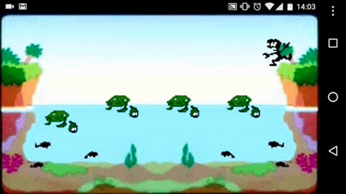

# mitai2-turtle-bridge
My first attempt at game making in M.I.T. AppInventor 2. Game is called Turtle Bridge

Files:
 * [AIA project file](https://github.com/ipepe/mitai2-turtle-bridge/blob/master/turtle_bridge_one.aia?raw=true)
 * [APK compiled file](https://github.com/ipepe/mitai2-turtle-bridge/blob/master/turtle_bridge_one.apk?raw=true)
